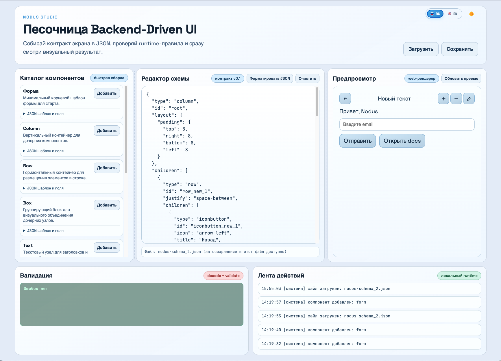

# Nodus BDUI Web Service (Live Preview)

Nodus BDUI Web Service - это сервис и веб-песочница для сборки контрактов интерфейса в JSON (Backend-Driven UI).
Он нужен для быстрого проектирования экранов: можно собрать схему из компонентов, сразу проверить runtime-валидацию и тут же увидеть визуальный результат в предпросмотре.
Такой подход ускоряет согласование между продуктом, дизайном и разработкой до публикации контракта в целевом backend/runtime.

## Экран Playground

Основной экран песочницы разделен на три рабочие области:
- `Каталог компонентов` слева: готовые шаблоны узлов и кнопка быстрого добавления в JSON.
- `Редактор схемы` по центру: редактирование контракта экрана с форматированием и очисткой до базового шаблона формы.
- `Предпросмотр` справа: live-рендер схемы, обновление runtime и визуальная проверка результата.

Нижняя часть содержит:
- `Валидация`: ошибки/статус decode+validate.
- `Лента действий`: события редактора и runtime.



## Run

### One-time foreground run

```bash
cd bdui-web-service
./start-service.sh
```

Open `http://127.0.0.1:8080`.

Custom host/port:

```bash
HOST=0.0.0.0 PORT=8090 ./start-service.sh
```

### Background service scripts

Restart service in background (single command):

```bash
cd bdui-web-service
./restart-service.sh
```

Stop background service:

```bash
cd bdui-web-service
./stop-service.sh
```

For background mode:

- PID file: `.server.pid`
- Log file: `.server.log`

## Live Preview: quick schema assembly

- In the left `Каталог компонентов / Component Library` panel choose a component card.
- Click `Добавить / Add` to append that JSON template into root `children` in the schema editor.
- Open `JSON шаблон и поля / JSON template and fields` to inspect the exact JSON and field hints before inserting.

## Endpoints

- `GET /api/health`
- `POST /api/decode-validate`

Example request:

```json
{
  "schema": {
    "type": "text",
    "value": "Hello"
  }
}
```
